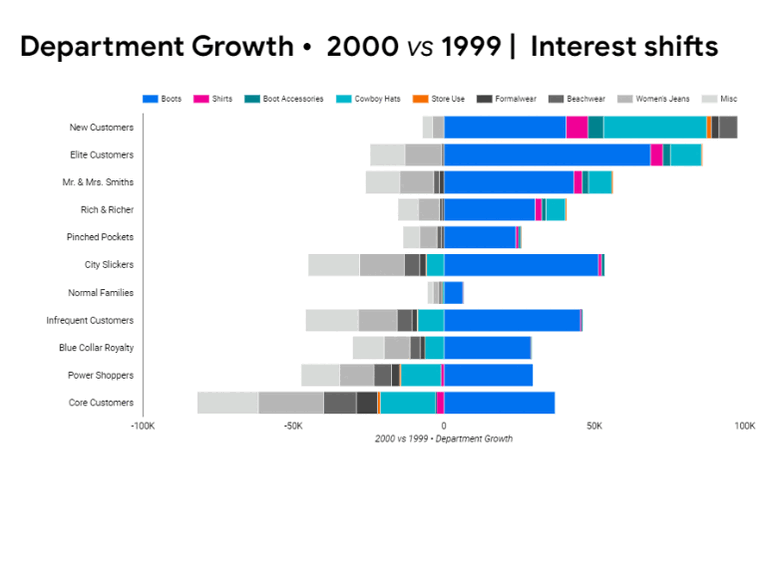

<!--
**IsisSantosCosta/IsisSantosCosta** is a ✨ _special_ ✨ repository because its `README.md` (this file) appears on your GitHub profile.

Here are some ideas to get you started:

- 🔭 I’m currently working on ...
- 🌱 I’m currently learning ...
- 👯 I’m looking to collaborate on ...
- 🤔 I’m looking for help with ...
- 💬 Ask me about ...
- 📫 How to reach me: ...
- 😄 Pronouns: ...
- ⚡ Fun fact: ...
-->

<!-- ----------------------------------------------------------------------------------------------------------------------------------- -->
<!-- Intro -->

<!-- [](https://github.com/isis-santos-costa/) -->
<!-- [](https://www.freecodecamp.org/isis-santos-costa/) -->
<!--  -->
<!-- [](https://github.com/isis-santos-costa/when-riders-meet-drivers/) -->

[](https://stackoverflow.com/users/7865030/isis-santos-costa/)
[](https://www.credly.com/badges/04d9aa52-5b65-41e3-8fa3-ba34cf279790)
[](https://www.linkedin.com/in/isis-santos-costa/)   

<!-- ----------------------------------------------------------------------------------------------------------------------------------- -->
<!-- Hi --> 
<!-- ```  

 👋 Hi! I'm Isis • interested in 💬 product data | b2b saas | plg 🧘 yoga 🌲 being outdoors with Lili 🐕  

``` -->

<!-- ----------------------------------------------------------------------------------------------------------------------------------- -->
<!-- Portfolio --> 
# Portfolio  
 
📌 __[Growth marketing analysis](https://github.com/isis-santos-costa/growth-marketing)
 &nbsp;&nbsp;&nbsp;&nbsp;&nbsp;&nbsp;&nbsp;&nbsp;
 ⇒ &nbsp;&nbsp; *A/B Testing and Department Growth • 2023*__ (WIP) 
&nbsp;&nbsp;</img>
&nbsp;&nbsp;</img>

📌 __[Seasonality as a growth lever](https://github.com/isis-santos-costa/when-riders-meet-drivers/blob/main/data-analysis.md)
 &nbsp;&nbsp;&nbsp;&nbsp;
 ⇒ &nbsp;&nbsp; *Orchestrating a two-sided marketplace • 2023*__ 
&nbsp;&nbsp;&nbsp;&nbsp;&nbsp;
&nbsp;&nbsp;</img>
&nbsp;&nbsp;</img>
&nbsp;&nbsp;</img>  


📌 __[Kaggle datasets into BigQuery](https://github.com/isis-santos-costa/kaggle-datasets-in-bigquery)
 &nbsp;&nbsp;
 ⇒ &nbsp;&nbsp; *Loading and troubleshooting • 2023*__ 
&nbsp;&nbsp;&nbsp;&nbsp;&nbsp;&nbsp;&nbsp;&nbsp;&nbsp;&nbsp;&nbsp;&nbsp;&nbsp;&nbsp;&nbsp;&nbsp;&nbsp;&nbsp;&nbsp;&nbsp;&nbsp;&nbsp;
&nbsp;&nbsp;</img>  

___

<!-- ----------------------------------------------------------------------------------------------------------------------------------- -->
# Featured

<!-- ----------------------------------------------------------------------------------------------------------------------------------- -->
<!-- Featured # 1 --> 
<!-- growth-marketing -->

<div id="user-content-toc"><ul><summary><h3 style="display: inline-block;"> 
     📍 <a href='https://github.com/isis-santos-costa/growth-marketing/'>
 <i>Growth marketing analysis</i> &nbsp;
&nbsp;&nbsp;</img>
&nbsp;&nbsp;</img></a></h3></summary>
</ul></div>

<table><tr>
<td></td>
<td>
This <a href='https://github.com/isis-santos-costa/growth-marketing/'>repository</a> presents the analysis of an <b>A/B test</b> for sales data of a <b>110,000 customer base</b> of a retail store.<br><br>

<b>Departmental growth</b> is also analyzed, summarizing <b>8,234</b> sales transactions to 
> (i) display the <b>department ranking</b> in terms of growth, year-over-year (YoY),  
> (ii) <b>reveal large-scale shifts in purchasing habits</b> of subsets of customers, and  
> (iii) <b>unveil overall trends across departments</b>, to be mitigated and to be boosted, for <b>future sales growth</b>.

<br>Tags: `growth`, `analytics`, `ab-testing`
</td>
</tr></table>

<br>

___

<!-- ----------------------------------------------------------------------------------------------------------------------------------- -->
<!-- Featured # 2 --> 
<!-- when-riders-meet-drivers -->

<div id="user-content-toc"><ul><summary><h3 style="display: inline-block;"> 
     📍 <a href='https://github.com/isis-santos-costa/when-riders-meet-drivers/blob/main/data-analysis.md'>
 <i>Seasonality as a growth lever for two-sided marketplaces</i> &nbsp;
&nbsp;&nbsp;</img>
&nbsp;&nbsp;</img>
&nbsp;&nbsp;</img></a></h3></summary>
</ul></div>


Carving out <b>predictability</b>.  <br><br>  
   
This [repository](https://github.com/isis-santos-costa/when-riders-meet-drivers/blob/main/data-analysis.md) uses **seasonal patterns** as a tool in identifying areas of **what can be predicted** within certain ranges. It is part of a study on **marketplaces**. Focusing on the issue of **timeliness**, a framework of analysis is proposed, designed to bring to light the points of match and contrast in the typical daily and weekly schedules of supply and demand.  

The proposed approach **enables an at-a-glance insight** into the following questions:  

> <i> « Are there any significant differences between preferred schedules on the supply and demand sides? » </i>  
> <i> « If so, when do the most critical disparities occur? » </i>

Tags: `product-analytics`, `sql`, `bigquery`

<br>

___

<!-- ----------------------------------------------------------------------------------------------------------------------------------- -->


