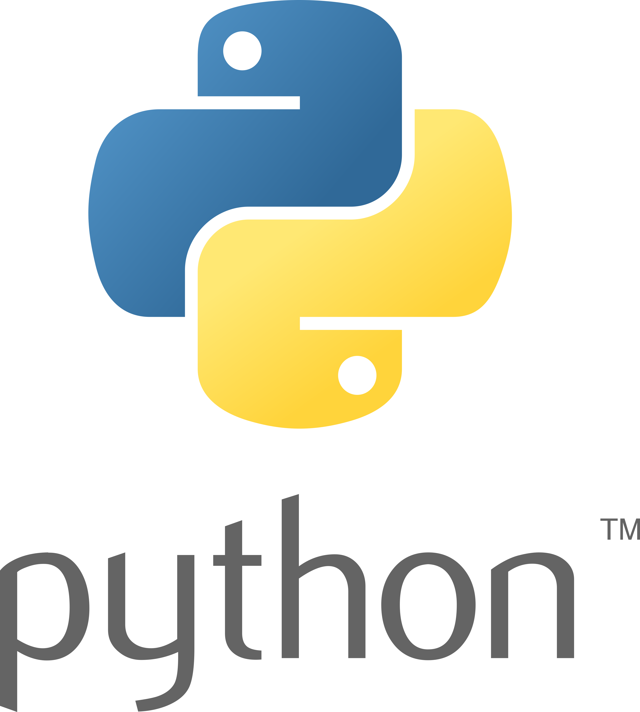
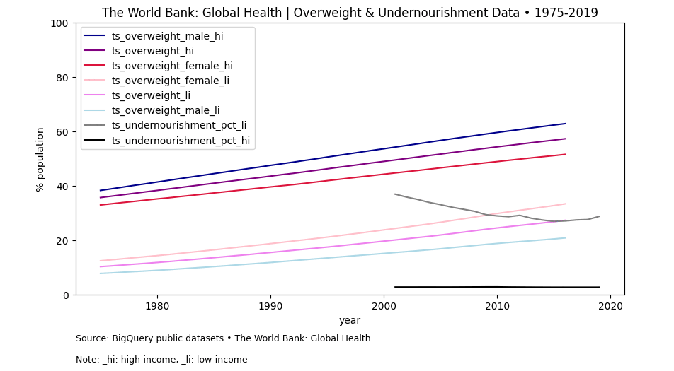

<!-- ----------------------------------------------------------------------------------------------------------------------------------- -->
<!--
**IsisSantosCosta/IsisSantosCosta** is a ✨ _special_ ✨ repository because its `README.md` (this file) appears on your GitHub profile.

Here are some ideas to get you started:

- 🔭 I’m currently working on ...
- 🌱 I’m currently learning ...
- 👯 I’m looking to collaborate on ...
- 🤔 I’m looking for help with ...
- 💬 Ask me about ...
- 📫 How to reach me: ...
- 😄 Pronouns: ...
- ⚡ Fun fact: ...
-->
<!-- ----------------------------------------------------------------------------------------------------------------------------------- -->
<!-- Intro -->

[](https://github.com/isis-santos-costa/)
[](https://stackoverflow.com/users/7865030/%c3%8dsis-santos-costa?tab=answers&sort=votes)
[](https://leetcode.com/isis-santos-costa/) 

<!-- ----------------------------------------------------------------------------------------------------------------------------------- -->
<!-- Hi --> 

Analytics Engineer • Trusted data assets [🔗](https://www.linkedin.com/in/isis-santos-costa/)

<!-- ```  

 👋 Hi! I'm Isis • interested in 💬 product data | b2b saas | plg 🧘 yoga 🌲 being outdoors with Lili 🐕  

``` -->

<!-- ----------------------------------------------------------------------------------------------------------------------------------- -->
<!-- Portfolio --> 
# Portfolio  
 
<div>  
 <br>
 Analytics Engineering
      <ul>
       <li><a href='https://www.kaggle.com/code/isissantoscosta/divvy-analytics/' target='_blank'>
      🚲 Divvy・Analytics</a> &nbsp;&nbsp;&nbsp;&nbsp;&nbsp;&nbsp;&nbsp;&nbsp;&nbsp;&nbsp;&nbsp;&nbsp;
        ⇒ &nbsp; <i>Canonicalization, DQ, Modular Design • Sep 2026</i>
      &nbsp; | &nbsp;&nbsp; First-principles ・ pure Python &nbsp; ( on Kaggle )
      </li>
     <li> <a href='https://github.com/isis-santos-costa/kaggle-datasets-in-bigquery/'>
      Kaggle data into BigQuery</a> &nbsp;&nbsp; ⇒ &nbsp; <i>Loading and troubleshooting • May 2023</i>
      &nbsp;&nbsp;&nbsp;&nbsp;&nbsp;&nbsp;&nbsp;&nbsp;&nbsp;&nbsp;&nbsp;&nbsp;
      &nbsp;&nbsp; | &nbsp;&nbsp; BigQuery
     </li>
     </ul><br>
 Data Analysis
     <ul style="margin: -10; padding: 0;">
      <li> <a href='https://www.kaggle.com/code/isissantoscosta/time-series-the-world-bank-global-health/' target='_blank'>
      The World Bank: Global Health</a> &nbsp;⇒ &nbsp; <i>Forecasting, Time Series Analysis • Nov 2024</i>
      &nbsp;&nbsp;&nbsp;&nbsp;&nbsp;&nbsp;&nbsp;&nbsp; | &nbsp;&nbsp; BigQuery ・ SQL ・ Python &nbsp; ( on Kaggle )
     </li>
     <li> <a href='https://github.com/isis-santos-costa/growth-marketing/'>
      Growth marketing analysis</a> &nbsp;&nbsp;&nbsp;&nbsp;&nbsp;&nbsp; ⇒ &nbsp; <i>A/B Testing and Department Growth • May 2023</i>
      &nbsp;&nbsp; | &nbsp;&nbsp; BigQuery ・ SQL ・ Looker Studio
     </li>
     <li> <a href='https://github.com/isis-santos-costa/when-riders-meet-drivers/blob/main/data-analysis.md'>
      Seasonality as a growth lever</a> &nbsp;&nbsp; ⇒ &nbsp; <i>Balancing a two-sided marketplace • May 2023</i>
      &nbsp;&nbsp;
      &nbsp;&nbsp; | &nbsp;&nbsp; BigQuery ・ SQL ・ Google Sheets
     </li>
     </ul><br>
 Utilities
     <ul>
      <li> <a href='https://www.kaggle.com/code/isissantoscosta/create-database-from-sql-file-sqlite/' target='_blank'>
      Utils | Executive-grade UI for notebooks</a> • Sep 2026
      &nbsp;&nbsp;
        | &nbsp;&nbsp; Python &nbsp; ( on Kaggle )
     </li>
      <li> <a href='https://www.kaggle.com/code/isissantoscosta/create-database-from-sql-file-sqlite/' target='_blank'>
      Utils | Create database from .sql file</a> • May 2025
      &nbsp;&nbsp;&nbsp;&nbsp;&nbsp;&nbsp;&nbsp;&nbsp;
        | &nbsp;&nbsp; SQLite ・ SQL ・ Python &nbsp; ( on Kaggle )
     </li>
     <li> <a href='https://www.kaggle.com/code/isissantoscosta/combine-csv-files/' target='_blank'>
      Utils | Combine CSV files</a> • May 2025
      &nbsp;&nbsp;&nbsp;&nbsp;&nbsp;&nbsp;&nbsp;&nbsp;&nbsp;&nbsp;&nbsp;&nbsp;&nbsp;&nbsp;&nbsp;&nbsp;&nbsp;&nbsp;&nbsp;
      &nbsp;&nbsp;&nbsp;&nbsp;&nbsp;&nbsp;
        | &nbsp;&nbsp; Python ・ pandas &nbsp; ( on Kaggle )
     </li>
     </ul>
</div>

<!-- ----------------------------------------------------------------------------------------------------------------------------------- -->
# Featured

<!-- ----------------------------------------------------------------------------------------------------------------------------------- -->
<!-- Featured # 1 --> 
<!-- the-world-bank-global-health -->

<div><h3>
     📌 <a href='https://www.kaggle.com/code/isissantoscosta/time-series-the-world-bank-global-health/' target='_blank'>
 <i>The World Bank: Global Health | Nutrition</i> 
      &nbsp;</img>
&nbsp;&nbsp;</img>
&nbsp;&nbsp;</img>
&nbsp;&nbsp;</img>
&nbsp;&nbsp;( on Kaggle )
     </a></h3>
</div>


 <!-- As the padding around a gif is zero, this 'zero width' image was added to let the text breath -->

**What are some universal silent factors that may be hindering longevity globally?**  <br><br>  

Driven by this question, data from Google BigQuery public dataset **« The World Bank: Global Health »** is extracted and explored in this <a href='https://www.kaggle.com/code/isissantoscosta/time-series-the-world-bank-global-health/' target='_blank'>analysis</a> to show trends and a forecasting interval on the double-sided burden of malnutrition that **overweight** and **undernourishment** place on public health.

<br>Tags: `public-health`, `time-series-analysis`  

<br>

[↑](#portfolio)

___

<!-- ----------------------------------------------------------------------------------------------------------------------------------- -->


